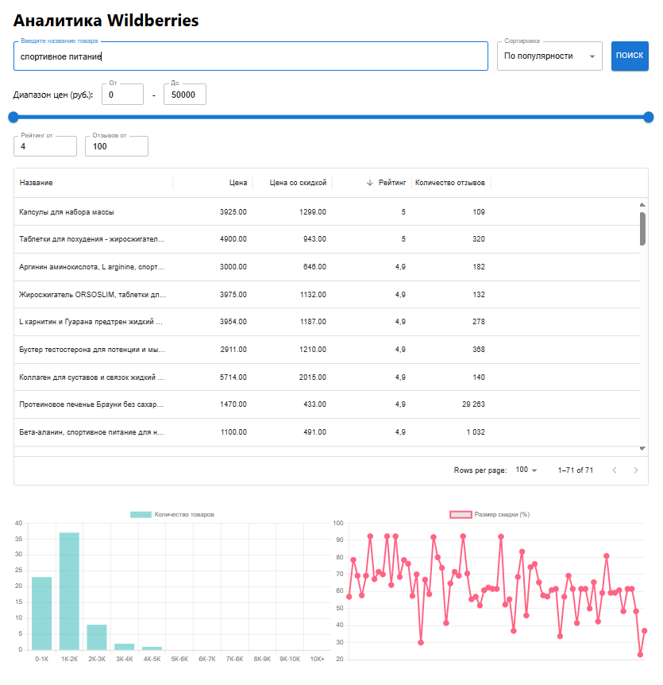

# Тестовое задание
#### **Позиция:** Веб-разработчик (Python/Django)
#### **Задача:** Парсинг и аналитика товаров с WB

## ЗАДАНИЕ
Создать простой сервис аналитики товаров с визуализацией данных на фронтенде.

### Часть 1: Backend

**Парсер данных:**

Написать скрипт для парсинга данных о товарах с сайта Wildberries (категория/запрос вносится пользователем).

Поля: название товара, цена, цена со скидкой, рейтинг, количество отзывов.

Сохранять данные в бд.

**API-эндпоинт:**

Создать эндпоинт /api/products/ с поддержкой фильтрации:

По цене, рейтингу, количеству отзывов.

Пример запроса: GET /api/products/?min_price=5000&min_rating=4.

### Часть 2: Frontend
**1. Таблица товаров**

- Создать таблицу с колонками:
- Название товара
- Цена
- Цена со скидкой
- Рейтинг
- Количество отзывов

**Функционал таблицы:**

Фильтры:
- Слайдер для диапазона цен (минимальная цена — максимальная цена).
- Фильтр по минимальному рейтингу (например, от 4.0 и выше).
- Фильтр по минимальному количеству отзывов (например, от 100 и выше).

Сортировка:

По возрастанию/убыванию рейтинга, количеству отзывов, цене, названию

Динамическое обновление: При изменении фильтров таблица должна перерисовываться с учетом новых данных.

**2. Диаграммы**

Реализовать графики, которые обновляются при изменении фильтров:

Гистограмма цен: Распределение цены vs количество товаров (диапазоны цен выбрать любые).

Линейный график: Размер скидки на товар vs рейтинг товара.

## Примечание
- Использована БД SQLite для простоты тестирования
- По умолчанию парсится первая страница выдачи Wildberries (до 100 товаров). При необходимости можно масштабировать на полный парсинг через обработку пагинации.

## Технологии
**Backend:**
- Python 3.7+
- Django + DRF
- Requests (для парсинга WB)
- SQLite (для тестирования)

**Frontend:**
- React
- Material-UI
- Chart.js

## Запуск проекта
```bash
git clone https://github.com/Dushnilo/wb-analytics-test-task.git

# Бекенд:
python -m venv venv
source venv/bin/activate  # Linux/Mac
venv\Scripts\activate    # Windows
pip install -r requirements.txt
cd backend
python manage.py makemigrations
python manage.py migrate
python manage.py runserver

# Фронтенд:
cd frontend
npm install
npm start
```

---
_Выполнено в рамках тестового задания._
